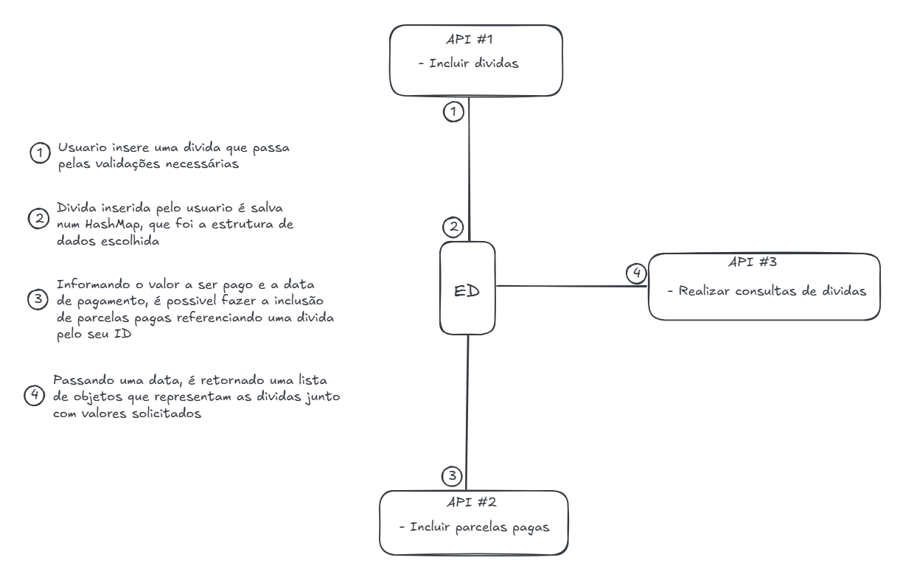

# 📊 **Sistema de Gerenciamento de Dívidas**

## ✏️ **Descrição do Projeto**

O **Sistema de Gerenciamento de Dívidas** é uma aplicação desenvolvida para organizar, gerenciar e registrar pagamentos relacionados a dívidas pessoais 💸. O sistema segue o padrão de arquitetura **Model → Repository → Service**, com foco em regras claras de negócio, validações e modularidade.

A aplicação permite:

✅ **Criar dívidas** com informações de principal, taxa de juros e data.  
✅ **Registrar pagamentos** associados a dívidas com controle de saldo.  
✅ **Consultar dívidas** por ID ou visualizar todas as dívidas no sistema.

---

## 🏗️ **Arquitetura do Projeto**

---

## 🛠️ **Estrutura de Camadas**

O código foi desenvolvido utilizando as seguintes camadas:

### 1️⃣ **Model - Representação das Entidades**
Contém as classes essenciais do sistema:

- **`Divida.java`** 
- 
  Representa uma dívida no sistema com atributos:
- 
    - **`id`**: Identificação única da dívida.
    - **`principal`**: Valor original da dívida.
    - **`saldo`**: Saldo atual restante da dívida.
    - **`dataDeAquisicao`**: Data da criação da dívida.
    - **`taxaDeJuros`**: Taxa anual de juros da dívida.
    - **`parcelas`**: Lista de pagamentos relacionados.
  

- **`Parcela.java`**  

  Representa uma parcela de pagamento com atributos:
    - **`valor`**: Valor da parcela.
    - **`data`**: Data em que foi efetuado o pagamento.

---

### 2️⃣ **Repository - Camada de Persistência**
Responsável por armazenar as informações no formato em memória:

- **`DividaRepository.java`**  
  Gerencia operações no armazenamento em memória:
    - **Criar nova dívida.**
    - **Buscar por ID ou retornar todas as dívidas.**
    - **Registrar pagamentos para atualizar o saldo da dívida.**

---

### 3️⃣ **Service - Camada de Lógica de Negócios**
Contém as regras de negócios, validações e integrações entre os dados e operações:

- **`GerenciadorDividas.java`**  
  Contém as regras de negócio para:
    - **Criar dívidas com validação.**
    - **Registrar pagamentos em uma dívida específica.**
    - **Consultar todas as dívidas ou buscar por um ID específico.**

---

## 🔎 **Testes**

Os testes estão localizados em `/test/GerenciadorDividasTest.java`. Eles validam as principais funcionalidades:

- **Criação de dívidas.**
- **Registro de pagamentos.**
- **Validação de consultas.**

Os testes utilizam a classe `GerenciadorDividas` diretamente.

---

# 📜 **Raciocínio**

A solução foi desenvolvida seguindo os seguintes princípios:

## **Arquitetura Modular**
- **Model**: Define os dados principais (Dívida, Parcela).
- **Repository**: Gerencia operações de persistência em memória.
- **Service**: Contém as regras de negócio, mantendo a lógica separada.

## **Validações**
Todas as entradas passaram por verificações para garantir que:
- Dívidas são criadas apenas com valores válidos.
- Pagamentos são registrados apenas quando possuem valores válidos e não excedem o saldo da dívida.

## **Testes**
Foram criados testes simples para validar os principais cenários e garantir que as operações funcionem corretamente.

---

## 🚀 **Como Executar**

### 1️⃣ **Pré-requisitos**
Certifique-se de que o Java está instalado corretamente no seu ambiente.

---

### 2️⃣ **Passos para execução**

1. **Compile o projeto:**  
   No IntelliJ IDEA ou sua IDE favorita:
  - Utilize `Ctrl + 5` 

2. **Execute os testes:**
  - Vá até o arquivo `/test/GerenciadorDividasTest.java`.
  - Execute o código para validar as funcionalidades.

---

# 📜 **Objetivo**

O projeto visa:

✅ Organizar e gerenciar pagamentos de dívidas.  
✅ Realizar cálculos automáticos de saldo e registrar pagamentos de forma consistente.  
✅ Manter as informações em memória, sem dependências externas (banco de dados ou REST).  
✅ Seguir boas práticas de desenvolvimento utilizando camadas bem definidas.

---

# 🏆 **Tecnologias e Ferramentas**
- **Java 11+** ☕
- **IntelliJ IDEA** 💻
- **Estrutura modular com Model, Repository e Service** 🛠️

---

# ✉️ **Contato**
**Desenvolvedor**: [Géssica Meireles ] 👨‍💻  
**E-mail**: [gessicadasilvameireles@gmail.com] 📧  
**GitHub**: [https://github.com/gessicameireles30 ] 🌐
